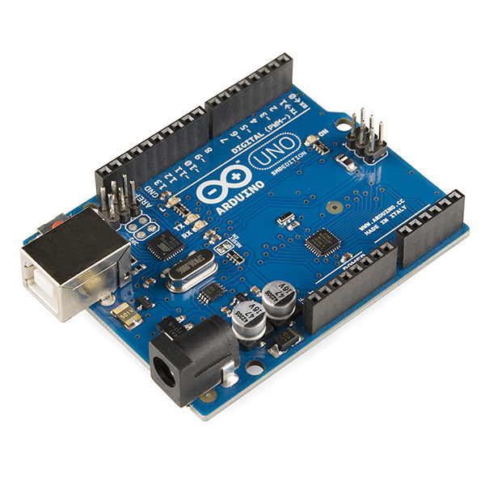
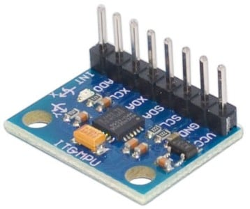
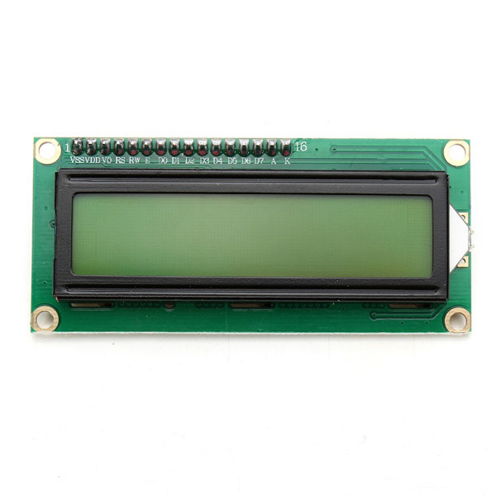
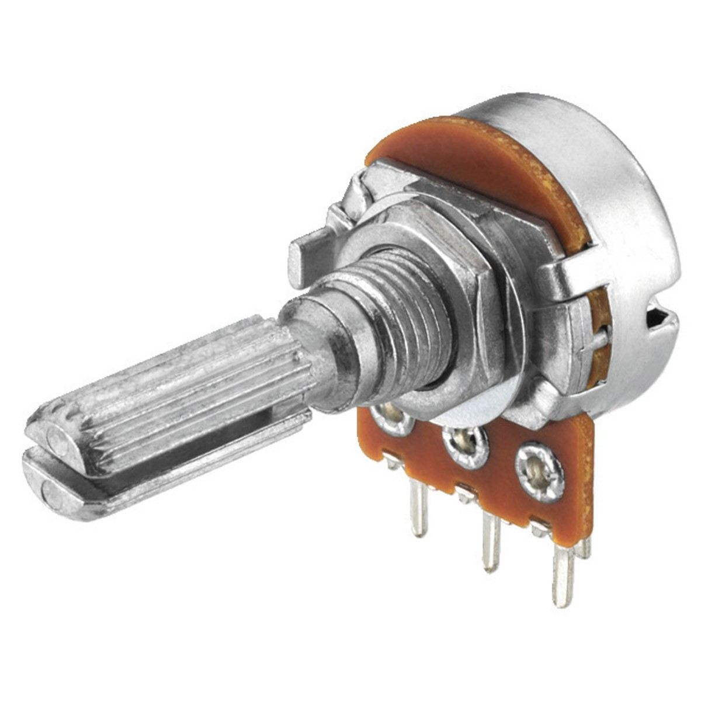
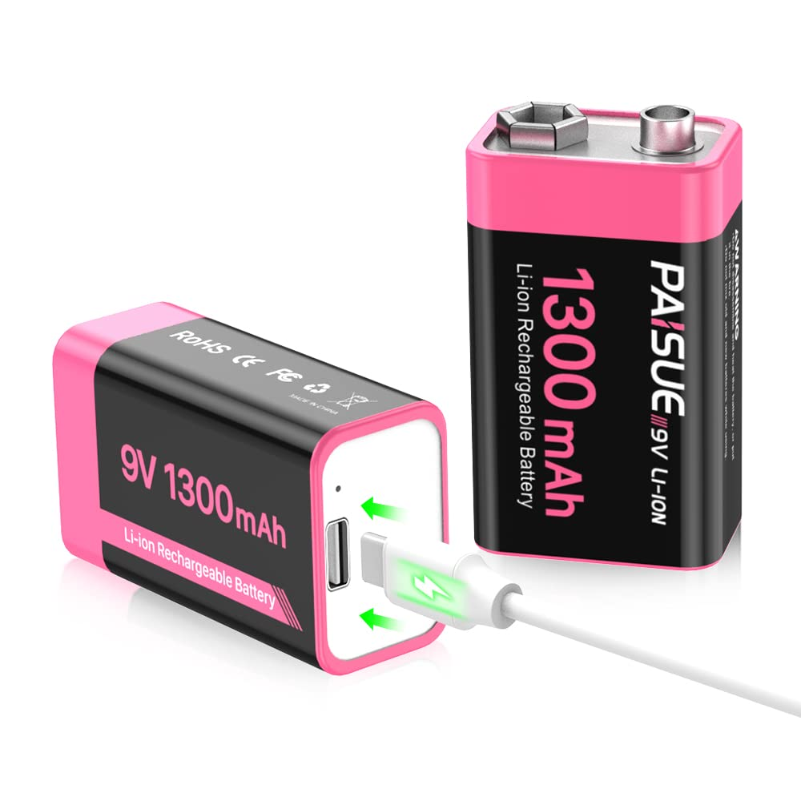
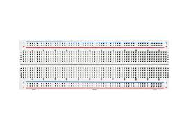
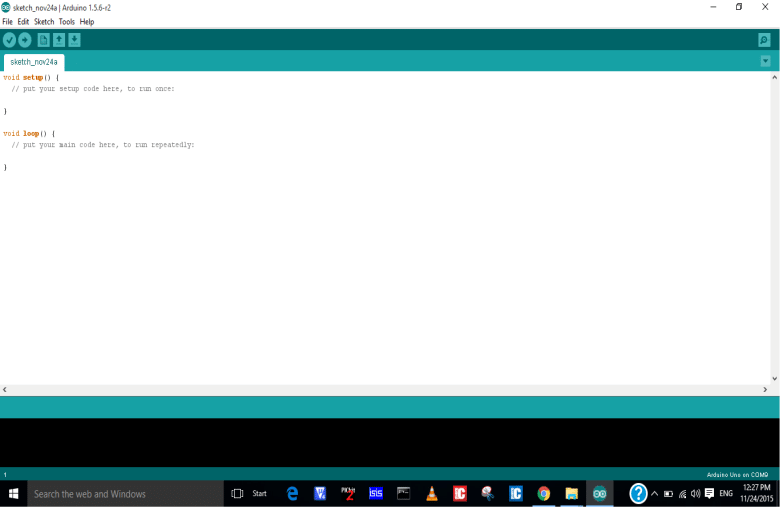
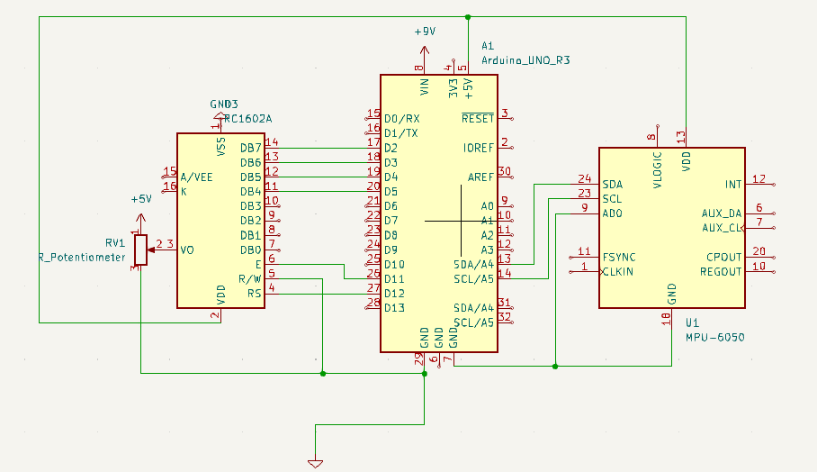

# Tekbot Robotics Challenge 2025

## Test 1 : Gyroscope & Accéléromètre (MPU-6050) - Gestion Durable des Déchets – Épreuve Électronique

**Équipe IFRI Électronique :**
* Aretha FAGLA
* Marielle AGBOSSOUNON
* Eunice ODJO
* Livingstone GBOZO

**Institution :** Institut de Formation et de Recherche en Informatique (IFRI), Université d'Abomey-Calavi
**Date :** 12 Juin 2025

---

## Table des matières

* [Introduction et Objectifs](#1-introduction-et-objectifs)
* [Matériel et branchements](#2-matériel-et-branchements)
* [Principe de fonctionnement du MPU-6050](#3-principe-de-fonctionnement-du-mpu-6050)
* [Architecture du système](#4-architecture-du-système)
* [Schéma électrique (KiCad)](#5-schéma-électrique-kicad)
* [Installation et compilation du code](#6-installation-et-compilation-du-code)
* [Explication détaillée du code](#7-explication-détaillée-du-code)
* [Mode d'emploi et démonstration](#8-mode-demploi-et-démonstration)
* [Résultats attendus](#9-résultats-attendus)
* [Conseils de réglage et calibration](#10-conseils-de-réglage-et-calibration)
* [Limitations et pistes d'amélioration](#11-limitations-et-pistes-damélioration)
* [Références et annexes](#12-références-et-annexes)

---

# 1. Introduction et Objectifs

## 1.1 Contexte

Le TEKBOT Robotics Challenge 2025 est une compétition internationale annuelle, organisée par TEKBOT Robotics (startup DeepTech basée au Bénin), qui met en compétition de jeunes talents africains autour de défis robotiques et d'IA. Le thème 2025, « Résilience Urbaine : Gestion Durable des Déchets », propose de concevoir des robots autonomes capables de collecter, trier et distribuer des déchets dans une simulation de ville fictive, EcoCity. Dans le cadre de la présélection, Test 1 évalue vos compétences en électronique et capteurs. L'objectif est de démontrer notre maîtrise du MPU-6050 (capteur 6 axes – accéléromètre + gyroscope) en mesurant et en affichant :

* L'orientation du mouvement (gauche, droite, haut, bas, stable) 
* La vitesse du mouvement 
* La restitution sur écran (LCD 16×2, en temps réel) 

## 1.2 Objectifs détaillés

* Mettre en œuvre la communication I2C pour lire en temps réel les registres du MPU-6050.
* Calibrer le capteur (mesure du biais du gyroscope et de la référence de l'accéléromètre).
* Traiter les données brutes :
    * Conversion LSB → unités réelles (g, °/s, m/s²),
    * Filtrage (Digital Low Pass Filter) et fusion capteurs (filtre complémentaire).
* Affichant, conformément à l'énoncé du test :
    * Orientation statique (haut, bas, gauche, droite, stable),
    * Vitesse d'accélération (en m/s²) sur un écran LCD 16×2.
* En nous plongeant dans un contexte réel de vol, nous avons étendu la détection à plusieurs types de mouvements dynamiques détaillant mieux quels types de mouvement à gauche, à droite, vers le haut ou le bas :
    * Montée / descente,
    * Virage gauche / virage droite,
    * Glissement avant / glissement arrière,
    * Glissement latéral,
    * Vol stable.
* Mesurer le Jerk (variation d'accélération) pour qualifier la « brutalité » des manœuvres.
* Afficher les résultats de manière claire et intuitive sur un écran LCD 16×2.
* Documenter l'ensemble du projet (schéma, code, explications) de façon à rendre la solution compréhensible, pérenne et partageable sur GitHub.

---

# 2. Matériel et branchements

## 2.1 Composants électroniques

### Arduino Uno:
* **Description:** Microcontrôleur ATmega328P, 14 GPIO, 6 entrées analogiques. 
* **Rôle dans le montage:** Cœur du système : il lit le capteur, exécute le code et pilote l'écran. 
* **Image:**
    * Img 1 : Arduino Uno
    

### MPU-6050:
* **Description:** Module I²C combinant un accéléromètre 3 axes ±2 g et un gyroscope 3 axes ±250 °/s. 
* **Rôle dans le montage:** Mesure l'orientation et l'accélération. 
* **Image:**
    * Img 2 : MPU-6050
    

### Écran LCD HD44780 16×2:
* **Description:** Afficheur alphanumérique 16 colonnes × 2 lignes en mode 4 bits. 
* **Rôle dans le montage:** Présente en temps réel l'orientation et l'intensité du mouvement. 
* **Image:**
    * Img 3 : Ecran LCD
    

### Potentiomètre 10kΩ:
* **Description:** Résistance variable linéaire. 
* **Rôle dans le montage:** Permet d'ajuster le contraste de l'écran LCD. 
* **Image:**
    * Img 4 : Potentiomètre
    

### Pile rechargeable 9V:
* **Description:** Source de tension. 
* **Rôle dans le montage:** Fournit une alimentation stable à l'Arduino, au module et à l'écran. 
* **Image:**
    * Img 5 : Pile 9V rechargeable
    

### Breadboard + fils Dupont:
* **Description:** Plaque d'essai sans soudure et câbles colorés. 
* **Rôle dans le montage:** Montage rapide, structuré et réutilisable. 
* **Images:**
    * Img 6 : Breadboard
    
    * Img 7 : Fils Dupont
    

## 2.2 Outils Logiciels

### Arduino IDE
* **Description:** Environnement de programmation officiel pour cartes Arduino. C/C++ simplifié, moniteur série intégré. 
* **Lien de téléchargement/Documentation:** https://www.arduino.cc/en/software 
* **Image:**
    * Img 8 : Logo/Image Arduino IDE
    

### I2Cdevlib / MPU6050
* **Description:** Bibliothèque Arduino pour communiquer facilement avec le MPU-6050, inclut fonctions de calibration et DMP. 
* **Lien de téléchargement/Documentation:** https://github.com/jrowberg/i2cdevlib 

### LiquidCrystal
* **Description:** Bibliothèque Arduino embarquée pour piloter les écrans HD44780 en mode 4 bits. 
* **Lien de téléchargement/Documentation:** Inclus dans l'IDE 

### KiCad
* **Description:** Suite open-source pour la création de schémas électroniques et de layouts de circuits imprimés. 
* **Lien de téléchargement/Documentation:** https://kicad.org/download/ 
* **Image:**
    * Img 9 : Logo/Image KiCad
    

### Git / GitHub
* **Description:** Outils de versionning et d'hébergement de code. 
* **Lien de téléchargement/Documentation:** https://git-scm.com/ / https://github.com 


## 2.3 Schéma de connexion

### 2.3.1 MPU-6050 ↔ Arduino

| Broche MPU-6050 | Broche Arduino | Fonction       |
|-----------------|----------------|----------------|
| VDD            | 5V             | Alimentation +5 V |
| GND             | GND            | Masse          |
| SDA             | A4 (SDA)       | Données I²C    |
| SCL             | A5 (SCL)       | Horloge I²C    |
| (AD0)           | GND            | Adresse I²C = 0x68 | 

### 2.3.2 Écran LCD 16x2 ↔ Arduino

| Broche LCD | Fonction                 | Broche Arduino         |
|------------|--------------------------|------------------------|
| VSS        | Masse                    | GND                    |
| VDD        | Alimentation +5V         | 5V                     |
| V0         | Contraste                | Curseur de pot.        |
| RS         | Register Select          | D12                    |
| E          | Enable                   | D11                    |
| D4         | Data bit 4               | D5                     |
| D5         | Data bit 5               | D4                     |
| D6         | Data bit 6               | D3                     |
| D7         | Data bit 7               | D2                     |
| RW         | Read/Write (à 0 pour écriture) | GND                    | 

### 2.3.3 Alimentation

| Élément         | Connexion                     | Remarque                                 |
|-----------------|-------------------------------|------------------------------------------|
| Pile 9V         | Entrée de l'Arduino (barrel jack)           | 9V                                       |
|                 | Masse → GND rail              |                                          |
---

# 3. Principe de fonctionnement du MPU-6050

Le MPU-6050 est un tout-en-un très utilisé dans les projets embarqués : c'est un module qui combine un accéléromètre 3 axes et un gyroscope 3 axes, le tout piloté par un microcontrôleur interne, le Digital Motion Processor (DMP). Grâce à ce DMP, on peut même déléguer certaines opérations de fusion de données au module lui-même, mais ici nous utiliserons les fonctions de base.

## 3.1 Accéléromètre

Imaginons une sorte de petit "pèse-personne" miniature intégré dans le capteur : il mesure la force d'accélération exercée sur lui suivant trois directions :
* Axe X : avant-arrière
* Axe Y : gauche-droite
* Axe Z : haut-bas

Quand l'objet est immobile et à plat, l'axe vertical (Z) "voit" ou est soumis à la gravité, soit +1 g (≈ 9,81 m/s²). Si nous inclinons le capteur, la valeur sur X ou Y varie en fonction de l'angle, nous donnant un moyen de calculer l'inclinaison (tilt).

L'accéléromètre du MPU-6050 peut être configuré pour mesurer jusqu'à ±2 g, ±4 g, ±8 g ou ±16 g, ce qui modifie sa résolution (le nombre de "pas" numériques par g). Pour notre usage, la plage ±2 g est idéale : elle offre la plus haute résolution (16 384 LSB pour 1 g).

## 3.2 Gyroscope

Un gyroscope MEMS est un capteur qui mesure la vitesse de rotation autour de trois axes :
* Rotation autour de X (roulis)
* Rotation autour de Y (tangage)
* Rotation autour de Z (lacet)

Concrètement, quand le capteur tourne, une structure vibrante à l'intérieur subit une force de Coriolis qui génère une tension proportionnelle à la vitesse angulaire. Le MPU-6050 peut mesurer jusqu'à ±250 °/s, ±500, ±1000 ou ±2000 °/s ; nous choisissons ±250 °/s pour maximiser la précision (131 LSB pour 1 °/s).

## 3.3 Registre et communication I2C

Le MPU-6050 communique avec l'Arduino via I²C, un bus de données à deux fils (SDA pour les données, SCL pour l'horloge), munis de résistances de "pull-up" pour rester à l'état haut quand personne n'émet. Son adresse I²C standard est 0x68 (ou 0x69 si on tire la broche AD0 à +V).

Pour lire une mesure, l'Arduino envoie d'abord un "START" puis l'adresse du capteur et le numéro du registre de départ (par exemple ACCEL_XOUT_H pour l'accélération X). Le capteur renvoie alors séquentiellement les octets suivants:
* Valeur brute de l'accélération X (high byte, low byte)
* Valeur brute de l'accélération Y
* Accélération Z
* Vitesse angulaire X, Y, Z

Ces valeurs sont codées sur 16 bits signés (–32 768 à +32 767). La bibliothèque I2Cdevlib et son pilote MPU6050 nous simplifient cette étape en fournissant directement la fonction `getMotion6()`, qui lit tout en une transaction.

## 3.4 Conversion des données brutes

Une fois que le module nous donne ces six valeurs entières, il faut les convertir en unités physiques:
* **Accélération en g :**
    * $a_g = \text{(Valeur brute)} / (\text{LSB/g})$
    * Puis en m/s² : $a_{m/s^2} = a_g \times 9.81$
* **Vitesse angulaire en °/s :**
    * $\omega_{°/s} = \text{(Valeur brute)} / \text{LSB/(°/s)}$

Ces conversions nous donnent des nombres directement exploitables pour savoir, par exemple, que l'objet tourne à 45 °/s autour de l'axe Z, ou subit une accélération de 3 m/s² vers la droite.

## 3.5 Filtrage et fusion

Brut, le capteur génère souvent du bruit : petites fluctuations aléatoires qui peuvent rendre l'affichage instable. Le MPU-6050 intègre un filtre passe-bas numérique (DLPF) que l'on règle (par ex. à 20 Hz ou 42 Hz) pour atténuer les hautes fréquences.

En outre, on combine l'accéléromètre et le gyroscope avec un filtre complémentaire:
* On intègre la vitesse angulaire pour obtenir un angle à court terme.
* On calcule l'angle "statique" depuis l'accéléromètre pour la stabilité long terme.
* On mélange les deux :
    * $\theta = \alpha(\theta + \omega\Delta t) + (1-\alpha)\theta_{acc}$
    * avec $\alpha \approx 0,94$.

Le résultat est un angle à la fois réactif et stable, idéal pour détecter le roulis ou le tangage de notre maquette d'avion.

---

# 4. Architecture du système

Avant de plonger dans le code, visualisons comment chaque élément matériel et logiciel interagit pour transformer des vibrations et des rotations en un affichage clair. 

## 4.1 Alimentation

Une pile rechargeable 9 V alimente le circuit. 
* L'Arduino Uno 
* Le module MPU-6050 
* L'écran LCD 16×2 

Toutes les parties partagent une même référence de masse et de tension, indispensable pour une mesure fiable. 

## 4.2 Microcontrôleur (Arduino)

L'Arduino Uno joue trois rôles : 
* **Maître I²C :** il envoie les ordres de lecture au MPU-6050 et récupère les données brutes. 
* **Traitement :** il convertit, filtre et fusionne ces mesures, détecte le type de mouvement et calcule le Jerk. 
* **Interface :** il pilote l'écran LCD pour afficher en temps réel le résultat, et communique sur le port série pour le debug. 

## 4.3 Capteur MPU-6050

Le MPU-6050 est l'élément source de données : 
* Il mesure en continu à la fréquence configurée (ex. 100 Hz). 
* Il stocke ces mesures dans ses registres internes, accessibles en I²C. 
* Il peut appliquer un DLPF et même un DMP pour fournir directement des angles fusionnés. 

## 4.4 Affichage et debug

### Écran LCD 16×2 :
* **Ligne 1 :** indique le type de mouvement (MONTEE, VIRAGE…, VOL STABLE). 
* **Ligne 2 :** affiche deux nombres, le score de Jerk et l'accélération totale (en m/s²). 

### Moniteur série (USB) :
* Une sortie textuelle détaillée permet de suivre en direct les angles, vitesses et valeurs brutes, très utile en phase de test. 

## 4.5 Flux de données

* **Lecture**
    * `getMotion6()` → récupère ax, ay, az, gx, gy, gz 
* **Calibration**
    * Soustraction des offsets (biais) du gyroscope 
    * Référence de l'accéléromètre au repos 
* **Conversion**
    * LSB → g, LSB → °/s 
    * g → m/s² 
* **Filtrage & fusion**
    * DLPF matériel → moins de bruit 
    * Filtre complémentaire logiciel → angle stable 
* **Détection**
    * Classification du mouvement par seuils 
    * Calcul du Jerk (variation d'accélération) 
* **Affichage**
    * LCD et moniteur série 

Chaque étape s'enchaîne dans la boucle principale (`loop()`), produisant un système fluide et réactif, prêt pour la démonstration.

---

# 5. Schéma Électrique (KiCad)

Pour garantir la clarté et la reproductibilité de notre montage, nous avons réalisé un schéma dans KiCad 7.0. Ci-dessous le rendu principal, suivi d'une explication progressive.

* **Figure:** Fig 1 : Schema_Kicad
    

## 5.1 Description des parties du schéma

### Bloc alimentation 
* Entrée : Pile → Arduino.
* Sortie : +5 V de l'Arduino. 

### Arduino Uno 
* Broches A4 (SDA) et A5 (SCL) reliées au MPU-6050. 
* Broches D2…D5, D11, D12 reliées au LCD en mode 4 bits. 
* Broches 5 V et GND alimentées par la pile 9V. 

### Module MPU-6050
* Broche VCC → +5 V, GND → GND. 
* Broche AD0 à GND (adresse 0x68). 
* Broche INT non utilisée (NC). 

### Écran LCD 16×2
* VSS → GND, VDD → +5 V, VO → curseur 10 kΩ (pour le contraste). 
* RS → D12, E → D11, D4 → D5, D5 → D4, D6 → D3, D7 → D2. 
* RW → GND (mode écriture). 

### Potentiomètre P1 (10 kΩ)
* Broche gauche → +5 V, broche droite → GND, curseur → VO du LCD. 

## 5.2 Fichiers KiCad

* Projet : `Kicad/` 
* Schematic : `Test1_MPU6050_Schema.kicad_sch` 
* Netlist : exportée pour documentation. 

**Note :** pour voir le projet complet, consultez le dossier `Kicad/` sur notre dépôt GitHub.  Les symboles ont été pris dans les librairies officielles de KiCad et adaptés pour clarifier les noms de broches. 

---

# 6. Installation et compilation du code

Avant d'uploader notre programme sur l'Arduino, il faut installer les outils et les bibliothèques nécessaires. 

## 6.1 Prérequis logiciels

### Arduino IDE (version ≥ 1.8.19)
* Télécharger et installer depuis : https://www.arduino.cc/en/software 

### Bibliothèques Arduino
* **I2Cdevlib** (pour I2Cdev.h et MPU6050.h)
    * `cd ~/Arduino/libraries`
    * `git clone https://github.com/jrowberg/i2cdevlib.git` 
* **LiquidCrystal**
    * Inclus d'origine dans l'IDE Arduino. 

## 6.2 Importer et compiler

1. Lancer l'IDE Arduino. 
2. Ouvrir `Test1_MPU6050.ino` dans le dossier `Arduino/Test1_MPU6050/`. 
3. Vérifier dans le menu `Croquis → Inclure une bibliothèque` que I2Cdevlib et LiquidCrystal apparaissent. 
4. Sélectionner la carte : `Outils → Type de carte → Arduino Uno`. 
5. Sélectionner le port série correspondant (`COMx` sous Windows, `/dev/ttyACM0` sous Linux). 
6. Cliquer sur `Téléverser` (flèche →) pour compiler et envoyer sur la carte. 

Une fois le téléversement réussi, l'écran LCD doit afficher "MAQUETTE AVION" pendant 3 s avant de passer aux mesures en direct.

---

# 7. Explication détaillée du code

Nous parcourons le programme en suivant son ordre d'exécution, en expliquant chaque bloc de manière claire et accessible :

## 7.1 En-tête et bibliothèques

**Objectif :** préparer les outils logiciels. 
On inclut : 
* `<Wire.h>` pour le bus I²C. 
* `<I2Cdev.h>` et `<MPU6050.h>` pour piloter le MPU-6050. 
* `<LiquidCrystal.h>` pour l'écran LCD. 

## 7.2 Déclaration des objets et variables globales

* `MPU6050 capteurMouvement;` et `LiquidCrystal ecran(...)` : création des instances pour le capteur et l'écran. 
* **Variables de calibration :** 
    * `erreurGyroX/Y/Z` pour le biais du gyroscope. 
    * `referenceAccelX/Y` pour la référence de l'accéléromètre au repos. 
* **Constantes de conversion :** 
    * `CONVERSION_ACCEL = 16384.0` (LSB → g). 
    * `CONVERSION_GYRO = 131.0` (LSB → °/s). 
* **Filtre :** 
    * `angleRoulis` et `angleTangage` seront les angles fusionnés. 
    * `FORCE_FILTRE = 0.94` pour combiner 94 % gyroscope, 6 % accéléro. 
* Variables pour le Jerk et les moyennes mobiles (détection de glissement). 

## 7.3 Calibration : `calibrerCapteur()`

* Accumulation de 1 000 mesures des axes gyro et accel. 
* Affichage de points de progression dans le moniteur série. 
* Calcul de la moyenne → ces valeurs deviennent : 
    * `erreurGyroX/Y/Z` pour corriger chaque lecture gyroscopique. 
    * `referenceAccelX/Y` (en g) pour positionner l'accéléromètre au repos. 
* Initialisation des moyennes mobiles `moyenneAccelX/Y` à ces références. 

## 7.4 setup()

* Démarrage du port série (`Serial.begin(9600)`) pour le debug. 
* Initialisation I²C (`Wire.begin()`) et réveil du capteur (`initialize()`). 
* **Vérification** (`testConnection()` sur `WHO_AM_I`) : 
    * Si échec, message d'erreur sur LCD et console, puis blocage. 
* **Configuration du MPU-6050 :** 
    * Plage ±2 g, ±250 °/s. 
    * Filtre passe-bas (DLPF) à 20 Hz pour réduire le bruit. 
* Calibration du capteur (appel à `calibrerCapteur(1000)`). 
* Message d'accueil sur l'écran LCD ("MAQUETTE AVION / PRET AU VOL"), puis pause de 3 s. 
* Initialisation du chronomètre (`dernierTemps = millis()`). 

## 7.5 Boucle principale : loop()

Chaque cycle dure 100 ms (~10 Hz) :
* **Lecture brutes** 
    ```cpp
    capteurMouvement.getMotion6(&ax,&ay,&az,&gx,&gy,&gz);
    ```
* **Temps écoulé** 
    ```cpp
    float deltaTemps = (millis() - dernierTemps) / 1000.0;
    dernierTemps = millis();
    ```
* **Correction & conversion** 
    * Gyro corrigé en °/s : `(gx - erreurGyroX) / CONVERSION_GYRO`. 
    * Accélération en g : `ax / CONVERSION_ACCEL`. 
* **Moyennes mobiles pour glissement :** 
    ```cpp
    moyenneAccelX = 0.95*moyenneAccelX + 0.05*aX;
    moyenneAccelY = 0.95*moyenneAccelY + 0.05*aY;
    ```
* **Fusion capteurs (filtre complémentaire) :** 
    * Calcul des angles accel par `atan2()`. 
    * Intégration du gyro (`angle += vitesse * dt`). 
    * Mélange : `angle = α*angleGyro + (1–α)*angleAccel`. 
* **Détection de type de mouvement** 
    * Priorité 1 : inclinaison (roll/pitch > ±12°) → "MONTEE", "DESCENTE", "VIRAGE…". 
    * Priorité 2 : lacet (vitesseZ > 45°/s) → "ROTATION". 
    * Priorité 3 : glissement avant/arrière (diffX > 0,15 g) → "AVANCE"/"RECULE". 
    * Priorité 4 : glissement latéral (diffY > 0,15 g) → "GLISSE…". 
    * Sinon : "VOL STABLE" après 5 cycles de stabilité. 
* **Calcul du Jerk** 
    * Accélération totale en m/s² : `sqrt(aX² + aY² + aZ²) * 9.81`. 
    * Différence avec la mesure précédente → lissage exponentiel pour `scoreJerk`. 
* **Affichage sur LCD** 
    * Ligne 1 : `mouvementDetecte`. 
    * Ligne 2 : `J:… A:… m/s2`, avec effacement des caractères résiduels. 
* **Debug série** 
    * Envoi des valeurs (angles, vitesses, accélérations, Jerk) sur le moniteur. 

## 7.6 Fonctions utilitaires

### remettreAZero() : 
* Réinitialise `angleRoulis`, `angleTangage`, `scoreJerk`, `moyenneAccelX/Y`. 
* Affiche "REMISE A ZERO" sur le LCD pour 2 s.

---

# 8. Mode d'emploi et démonstration

## 8.1 Mise sous tension

1. Pile 9v → Arduino Uno
2. Connecter l'Arduino via USB pour le debug (facultatif). 
3. Allumer l'interrupteur (si présent). 

## 8.2 Déroulé de la séquence

1. À l'allumage, le LCD affiche "MAQUETTE AVION / PRET AU VOL" (3 s). 
2. Le système entre en mode mesure : 
    * LCD ligne 1 : type de mouvement détecté (MONTEE, VIRAGE…, VOL STABLE). 
    * LCD ligne 2 : J:score Jerk A:accélération m/s². 
3. Manœuvres à tester :
    * Inclinaison lente → "MONTEE" ou "DESCENTE". 
    * Virage (basculer gauche/droite) → "VIRAGE GAUCHE/DROITE". 
    * Glissement sur la table → "AVANCE", "RECULE", "GLISSE…". 
    * Rotation rapide → "ROTATION G" ou "ROTATION D". 
    * Pas de mouvement → "VOL STABLE" après 0,5 s. 

## 8.3 Utilisation du moniteur série

* 9600 bauds. 
* Affiche en continu : 
    * `MONTEE | R:… T:… | Lacet:… |` 
    * `AX:… DX:… AY:… DY:… | Jerk:…` 

**Vidéo de démonstration :**
Vous pouvez visionner une démonstration de notre système en action ci-dessous :


---

# 9. Résultats attendus

Pour valider le test, voici trois scénarios typiques avec captures d'écran simulées : 

| Scénario             | LCD Ligne 1      | LCD Ligne 2      | Moniteur série extrait |
|----------------------|------------------|------------------|------------------------|
| Inclinaison vers l'avant | MONTEE           | J: 5 A: 11.3 m/s² | `MONTEE`               |
| Virage à droite      |  VIRAGE DROITE          |    J: 3 A: 9.5 m/s²              | ``VIRAGE DROITE``      |
| Glissement latéral      |        GLISSE DROITE          |      J: 2 A: 9.9 m/s²            | ``GLISSE DROITE``      |
| Repos                | VOL STABLE       | J: 0 A: 9.81 m/s² | ``VOL STABLE``         |

**Remarque :**
* Les valeurs de Jerk varient selon la brutalité du mouvement (plus le pic est élevé, plus la manœuvre a été soudaine). 
* L'accélération en m/s² se stabilise autour de 9,81 m/s² au repos (1 g).

---

# 10. Conseils de réglage et calibration

Afin d'optimiser la précision et la stabilité de votre système, voici quelques bonnes pratiques et ajustements possibles :

## 10.1 Refaire la calibration selon l'environnement

* **Surface stable et horizontale**: Toujours placer le capteur immobile sur une surface parfaitement plane et sans vibrations pendant la calibration.
* **Nombre d'échantillons**: Par défaut nous prenons 1 000 mesures (≈ 10 s). Vous pouvez augmenter ce nombre (ex. 2 000) pour affiner le biais du gyroscope au prix d'un temps de calibration plus long.
* **Température**: Les caractéristiques MEMS varient légèrement avec la température. Si votre environnement change beaucoup (extérieur vs intérieur), réalisez une nouvelle calibration.

## 10.2 Ajuster les seuils de détection

Les seuils définissent quand le programme passe d'un mouvement à un autre :

| Seuil actuel | Usage                           | Ajustement possible                                  |
|--------------|---------------------------------|------------------------------------------------------|
| ±12°         | Détecter roulis/tangage         | +/– 8° pour plus de sensibilité                     |
| 45 °/s       | Détecter lacet                  | 60 °/s si rotations plus rapides                     |
| 0,15 g       | Glissements avant/arrière       | 0,10 g pour capter de plus faibles déplacements      |

**Astuce :** testez chaque seuil avec des mouvements lents puis rapides et observez le comportement sur le moniteur série avant de modifier le code.

## 10.3 Régler le filtre passe-bas (DLPF)

* **DLPF à 20 Hz** (configuration actuelle) [cite: 121]: supprime la majorité du bruit haute fréquence, recommandé pour un robot lent ou une maquette.
* **DLPF à 42 Hz ou 98 Hz** [cite: 122]: plus réactif aux mouvements rapides, au prix d'un peu plus de bruit.
* Modifier la ligne :
    ```cpp
    capteurMouvement.setDLPFMode(MPU6050_DLPF_BW_42);
    ```
    dans `setup()` pour tester différentes fréquences.

## 10.4 Filtre complémentaire vs DMP

### Filtre logiciel (complémentaire)
* Réglage du coefficient α (0,94) [cite: 125]: ajustez-le vers 0,98 pour plus de stabilité long terme ou 0,90 pour plus de réactivité.

### DMP interne
* Charge le microcode dans le MPU-6050 et laisse le DMP fusionner accéléro+gyro automatiquement.
* **Avantage** [cite: 127]: résultats déjà filtrés, moins de code sur l'Arduino.
* **Inconvénient** [cite: 128]: setup plus complexe (chargement de firmwares) et moins de contrôle direct.

---

# 11. Limitations et pistes d'amélioration

Même si notre solution répond au Test 1, voici quelques points à considérer pour aller plus loin :

## 11.1 Limitations actuelles

* **Utilisation de String Arduino**: Peut fragmenter la mémoire dynamique (heap) sur le long terme, provoquant des plantages.
* **Affichage LCD limité**: Le HD44780 est lent (quelques millisecondes par print), donc fréquence d'affichage limitée à ~10 Hz.
* **Pas d'interruption I²C / DMP**: Lecture périodique via `delay()` ; pas d'usage des interruptions MPU-6050 ou du DMP pour des mesures plus rapides et efficaces.
* **Montage sur breadboard**: Sensible aux faux contacts et au bruit électrique, surtout sur I²C.

## 11.2 Pistes d'amélioration

* **Passer à `char[]` plutôt qu'à String**: Utiliser `snprintf()` pour formater les chaînes sans fragments mémoire.
* **Utiliser le DMP**: Charger le microcode, lire les quaternions directement, et en déduire les angles sans filtre logiciel.
* **Optimiser l'affichage**: Mettre à jour l'écran LCD seulement quand l'affichage change réellement (comparer l'ancienne et la nouvelle ligne).
* **Passer à un afficheur plus rapide (OLED I²C)**  pour des taux de rafraîchissement plus élevés.
* **Enregistrer les données**: Ajouter un module carte SD pour logger les valeurs brutes ou filtrées, utile pour l'analyse post-test.
* **Utiliser des interruptions**: Configurer l'INT du MPU-6050 pour déclencher une interruption sur l'Arduino dès qu'une nouvelle mesure est prête, et traiter sans `delay()`.
* **Conception PCB**: Remplacer la breadboard par un circuit imprimé (PCB) pour fiabilité électrique et mécanique.

---

# 12. Références et annexes

## 12.1 Références

* **MPU-6050 (InvenSense)**
    * "InvenSense, « MPU-6000 and MPU-6050 Product Specification Revision 3.4 », 2013"
    * [https://invensense.tdk.com/wp-content/uploads/2015/02/MPU-6000-Datasheet1.pdf](https://invensense.tdk.com/wp-content/uploads/2015/02/MPU-6000-Datasheet1.pdf)
* **Documentation I2Cdevlib**
    * "Jeff Rowberg, « i2cdevlib/MPU6050 », GitHub"
    * [https://github.com/jrowberg/i2cdevlib/tree/master/Arduino/MPU6050](https://github.com/jrowberg/i2cdevlib/tree/master/Arduino/MPU6050)
* **LiquidCrystal (HD44780)**
    * "Arduino, « LiquidCrystal Library Reference »"
    * [https://www.arduino.cc/en/Reference/LiquidCrystal](https://www.arduino.cc/en/Reference/LiquidCrystal)
* **KiCad EDA**
    * "KiCad Developers, « KiCad Schematic and PCB CAD »"
    * [https://www.kicad.org/](https://www.kicad.org/)
* **Arduino IDE**
    * "Arduino, « Download the Arduino IDE »"
    * [https://www.arduino.cc/en/software](https://www.arduino.cc/en/software)
* **Régulateur 7805**
    * "ON Semiconductor, « LM7805 Series Positive Voltage Regulator »"
    * [https://www.onsemi.com/pdf/datasheet/lm7805-d.pdf](https://www.onsemi.com/pdf/datasheet/lm7805-d.pdf)

## 12.2 Annexes

### A. Code source complet
Le code complet est disponible dans le fichier `Test1_MPU6050.ino` de notre dépôt GitHub :
[https://github.com/votre-equipe/tekbot-trc2025/blob/main/Test1/Test1_MPU6050.ino](https://github.com/votre-equipe/tekbot-trc2025/blob/main/Test1/Test1_MPU6050.ino)

### B. Fichiers KiCad
* **Schéma :** `Kicad/Test1_MPU6050_Schema.kicad_sch`


### C. Glossaire

| Terme | Définition                                                              |
|-------|-------------------------------------------------------------------------|
| LSB   | Least Significant Bit, unité numérique élémentaire des convertisseurs. |
| DLPF  | Digital Low Pass Filter, filtre numérique passe-bas intégré au capteur. |
| DMP   | Digital Motion Processor, coprocesseur interne du MPU pour fusion de données. |
| Jerk  | Variation de l'accélération, mesurée en m/s³ (ici simplifiée en score arbitraire). |
---


**Fin de la documentation du Test 1 Electronique – Tekbot Robotics Challenge 2025**