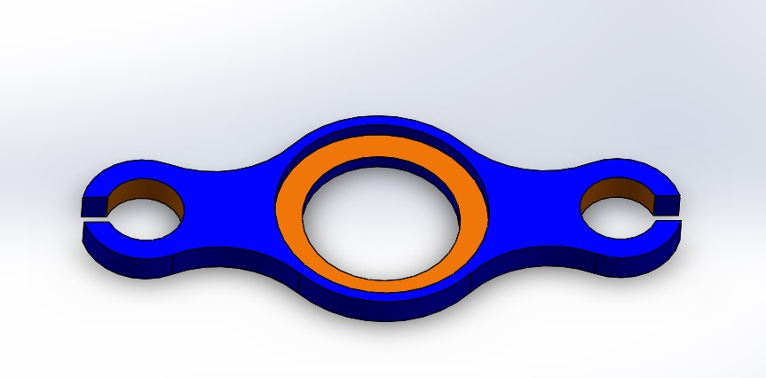
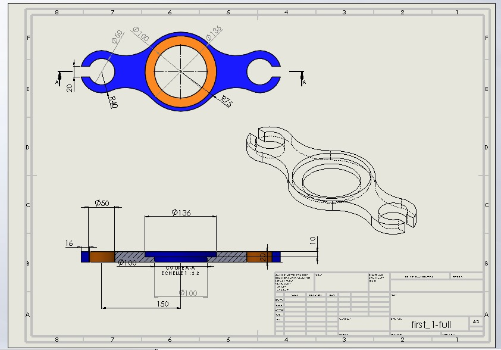
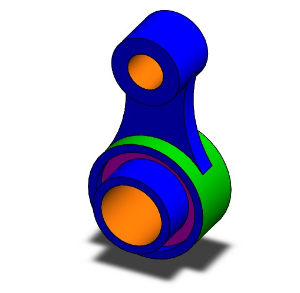
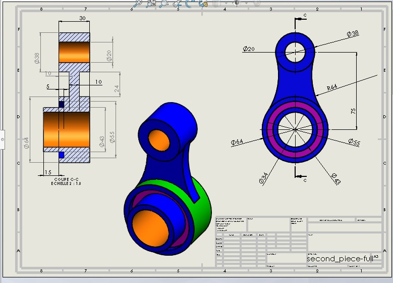
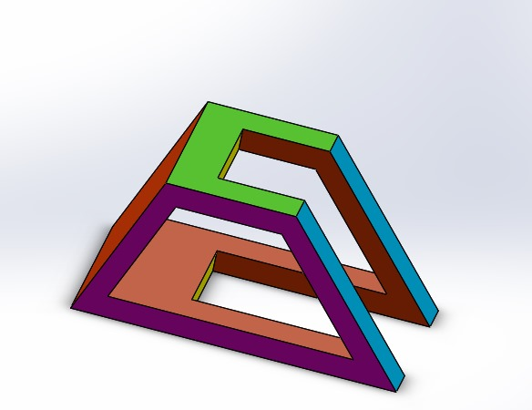
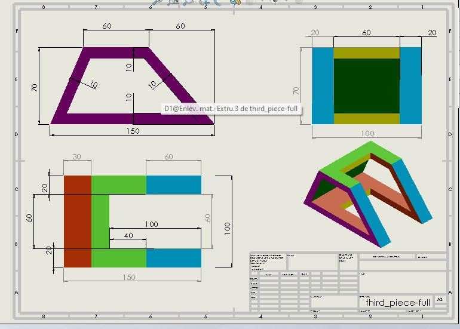
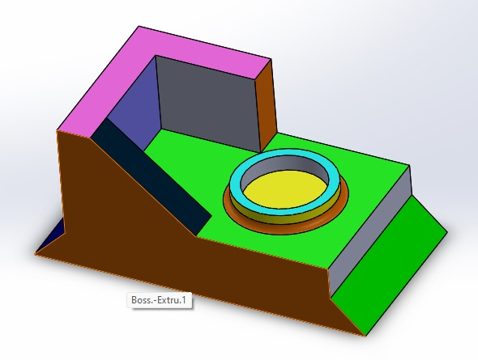
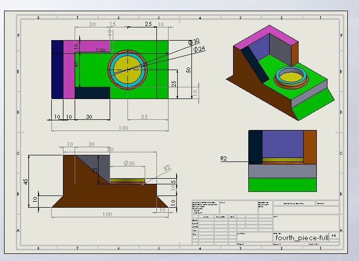
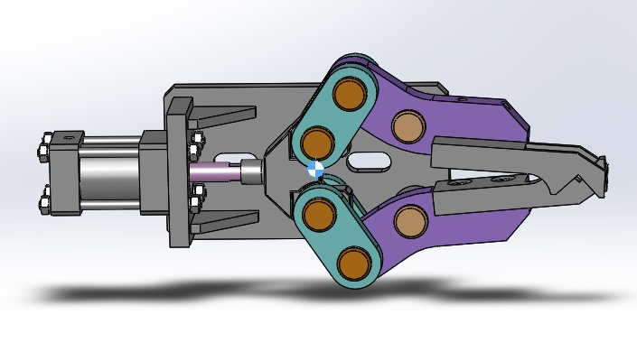
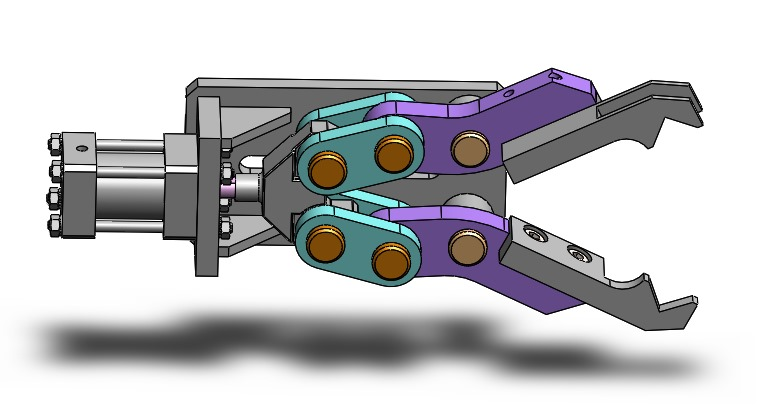

# Tests de mécaniques - TRC 2025

## Test 1 - Niveau débutant

Ce test consiste à concevoir un certain nombre de pièces en respectant les contraintes imposées (matériaux, dimensions ...). Pour ce faire, il faudra réaliser un croquis incluant des formes géométriques de base telles que des rectangles, des cercles et des polygones pour enfin arriver à modéliser des pièces tridimensionnelles à partir des croquis créés.

## Technologie
La conception des pièces a été réalisée avec le logiciel de modélisation **SolidWorks 2025**.

## Présentation des croquis
### Pièce 1
**Caractéristiques** : 
- **Systèmes d'unités** : MMGS (millimètre, gramme, seconde) ;
- **Décimales** : 2
- Tous les trous sont débouchants sauf indication contraire
- **Matériau** : acier AISI 1020 ; Densité : 0,0079 g/mm^3

**Etapes de réalisation de ce croquis**
1. Création d'un nouveau projet
- Réalisation de la partie circulaire
  - Créer une nouvelle pièce et sélectionner le plan de dessus pour l'esquisse.
  - Dessiner le cercle de diamètre extérieur de **135.6mm** en utilisant l'outil **circle**.
  - Ajouter deux cercles latéraux de rayon **40 mm** , à **150 mm** d'écartement total, soit **75 mm** de chaque côté par rapport à l'axe vertical.
  - L'ensemble a été relié avec des courbes tangentes (arcs de cercle) pour former le contour fluide de la pièce (entre R75 et R40).
2. Extrusion du profil
   - L'extrusion a été réalisée avec l'outil **Extrusion Boss/Base** pour extruder sur une profondeur de **20 mm**.
3. Création du trou central
   - Tracer un cercle centré de **100 mm** et couper sur une épaisseur de **20 mm** avec l'outil **Extruded cut**.
4. Création de la gorge annulaire
   - Dessiner un deuxième cercle concentrique de **Ø135.6 mm** (extérieur) et **Ø100 mm** (intérieur).
   - Extruder la couronne à une profondeur de **10 mm**, créant ainsi un relief annulaire sur la face supérieure.
5. Perçage des petits trous latéraux
   - Tracer deux petits cercles de **Ø50 mm** dans les extrémités latérales (trou dans les disques de **Ø100**).
   - Couper entièrement à travers la pièce.
6. Configuer la matière recommandée : **acier AISI 1020 ; Densité : 0,0079 g/mm^3**
   - Aller dans l'onglet **matériau** puis sélectionner éditer matériau puis choisir l'option acier AISI 1020.

7. Calcul de la masse
   - Pour trouver la masse, aller dans l'onglet **propriété de masse** et régler la densité et les décimales. La masse de cette pièce est **2811.1991 grammes**.

### Pièce 2
**Caractéristiques**
- **Systèmes d'unités** : MMGS (millimètre, gramme, seconde) ;
- **Décimales** : 2
- Tous les trous sont débouchants sauf indication contraire
- **Matériau** : Aluminium Alliage 1060 ; Densité : 0.0027 g/mm^3

**Etapes de réalisation de ce croquis**
1. Création d'un nouveau projet
2. Esquisse du profil principal
   - Sur le **plan de face**, tracer le **profil symétrique** de la pièce (moitié droite) en se basant sur la vue en coupe (section A-A).
   - Respecter les différents diamètres (**Ø64**, **Ø55**, **Ø43**, **Ø38**, **Ø34**, **Ø20**) ainsi que les longueurs (**30 mm**, **10 mm**, **24 mm**, etc.).

3. Fonction Révolution
   - Utiliser la commande **"Révolution de base"** (`Revolve Boss/Base`) autour de l'axe vertical pour créer le volume à partir du profil.

4. Ajout des congés latéraux
   - À l'aide de l'outil **"Congé"** (`Fillet`), appliquer les **R64 mm** pour adoucir les courbes latérales.

5. Création des perçages
   - Utiliser **"Coupe extrudée"** (`Extruded Cut`) pour ajouter les **trous traversants Ø20 et Ø34**, positionnés sur les deux extrémités circulaires.

6. Calcul de la masse
   - Attribuer le matériau : Aluminium Alliage 1060 via l'option **"Matériau"**.
   - Utiliser l'onglet **"Propriétés de masse"** pour obtenir la **masse exacte en grammes** de la pièce.
     
La masse de cette pièce est **290.80 grammes**.

### Pièce 3
**Caractéristiques**
- **Systèmes d'unités** : MMGS (millimètre, gramme, seconde) ;
- **Décimales** : 2
- Tous les trous sont débouchants sauf indication contraire
- **Matériau** : acier AISI 1020 ; Densité : 0,0079 g/mm^3

**Etapes de réalisation de ce croquis**
1. Esquisse du profil de base
   - Sur le **plan de face**, tracer la **forme fermée en trapèze** (vue en bas à gauche) en respectant les cotes :
     - Base : 150 mm
     - Hauteur : 70 mm
     - Épaisseur du profil : 10 mm

2. Fonction Extrusion
   - Utiliser la commande **"Bossage/Base extrudé"** (`Extruded Boss/Base`) sur **100 mm** de profondeur pour créer le volume.

3. Création des évidements
   - Créer des **vides rectangulaires** (100×60×20 mm) à l'avant et à l'arrière avec **"Coupe extrudée"** (`Extruded Cut`), comme visible dans les vues de droite et du haut.

4. Ajout des blocs latéraux
   - Deux **blocs de 20×60×70 mm** ont été extrudés sur chaque extrémité.

5. Calcul de la masse
   - Attribuer le matériau demandé : **acier AISI 1020**.
   - Utiliser **"Propriétés de masse"** pour obtenir la **masse exacte en grammes**.

La masse de cette pièce est **1633.25 grammes**.

### Pièce 4
**Caractéristiques**
- **Systèmes d'unités** : MMGS (millimètre, gramme, seconde) ;
- **Décimales** : 2
- Tous les trous sont débouchants sauf indication contraire
- **Matériau** : Aluminium Alliage 1060 ; Densité : 0.0027 g/mm^3

**Etapes de réalisation de ce croquis**
1. Esquisse de base
- Créer l'esquisse principale (vue de dessus) avec les dimensions 100×50 mm
- Définir les différentes sections colorées comme zones de référence

2. Extrusion principale
- Extruder la forme de base sur une hauteur de 25 mm
- Utiliser les cotes indiquées pour les différentes sections

3. Perçage cylindrique
- Créer un perçage Ø30 mm traversant
- Positionner selon les cotes de localisation (35 mm du bord)
- Ajouter l'évidement Ø24 mm en surface

4. Géométrie inclinée (vue de profil gauche)
- Utiliser la fonction Plan incliné ou Balayage
- Créer la rampe avec l'angle de 45° indiqué
- Respecter les dimensions de transition (R2 pour les congés)

5. Section transversale complexe
- Modéliser les différents niveaux de hauteur (10-15-25 mm)
- Intégrer les rayons de raccordement R2
- Créer les découpes et évidements selon les profils

6. Finitions
- Appliquer les congés et chanfreins
- Vérifier les contraintes dimensionnelles
- Valider l'assemblage des différentes fonctions

La masse de cette pièce est **297.29 grammes**.

### Assemblage
**Caractéristiques**
- **Systèmes d'unités** : MMGS (millimètre, gramme, seconde) ;
- **Décimales** : 2
- **Origine de l'assemblage** : Celui du fichier assemblage Pince

L'étape de l'assemblage de pièces consiste à former une pince mécanique. Le travail a été réalisé en respectant les contraintes imposées par les plans d'assemblage.

a) Après avoir fixé l'embout de vérin dans sa position minimale, les coordonnées du centre de masse de cet assemblage sont les suivantes : 
- X = **-29.15 mm**
- Y = **0.16 mm**
- Z = **19.86 mm**

 b) Après avoir fixé l'embout de vérin dans sa position maximale, les coordonnées du centre de masse de cet assemblage sont les suivantes :
- X = **-25.78 mm**
- Y = **0.06 mm**
- Z = **19.86 mm**

### Emplacement des fichiers
Les fichiers contenant les pièces modélisées ainsi que l'assemblage sont situées dans le dossier **Beginner_test_meca**.

## Video de la Pince en mouvement

[video](https://vimeo.com/manage/videos/1092855533/480fde870c)

### Contribution au projet
Les apports de contribution sont les bienvenus.
